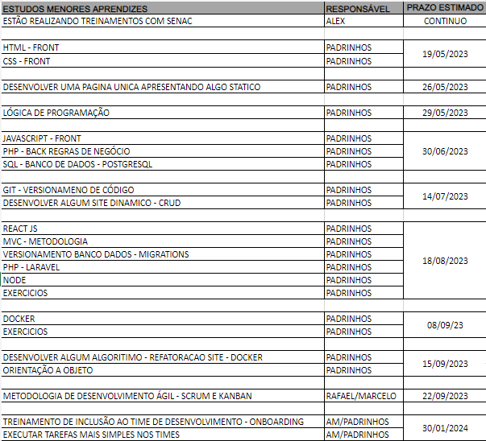

# Projetos-Gazin

Este repositório é para meus projetos desenvolvidos como aprendiz na Gazin Tech em 2023, as pastas são separadas por linguagem como por ex:

- Pasta Javascript -> Contem meus projetos em Javascript

,mas também é dividida por frameworks ou bibliotecas. Ex:
 - Pasta PHP -> Contem projetos em PHP bruto
 - Pasta LARAVEL -> Contem projetos em PHP, mas somente os que utilizam o framework Laravel

A criação desses projetos foi feita com base no seguinte cronograma: 

